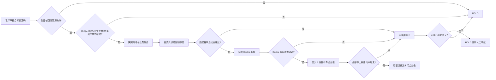

# 受控金丝雀与回滚

用本流程执行硬件适配器安装、Doctor 部署、隔离自愈实验和生产金丝雀。金丝雀是一次有边界的变更实验，不是只读诊断的延伸。

## 状态机

## 1. 必须先有金丝雀 manifest

manifest 未绑定以下内容前不得开始：

- 物理主机与维护窗口；
- 已评审的合并 commit 与受保护的发布分支；
- CI run/job 与制品来源；
- Doctor 二进制、适配器、配置、unit、策略的 SHA-256；
- Doctor 版本与架构；
- 变更工单与明确的执行授权；
- 现场安全观察员及其报告的急停姿态——无机器 getter 时必须明确标注为人工观察；
- 回滚责任人、旧版本哈希、回滚文件、中止沟通渠道；
- 预期证据路径与有效窗口。

制品必须来自已评审已合并的源码。本地构建或 PR 分支的产物可以离线测试，但不能称为生产候选。

## 2. 金丝雀前门禁必须全部满足

为以下各项取得新鲜且经独立验证的证据：

- 确切的物理机器人身份与足够同步的时钟；
- CPU 温度 Healthy，且来源无过期数据；
- Doctor 检查集完整，无 Critical、无 Unknown；
- 所有权审批完整且在有效期内；
- 交付/outbox 完整性与容量；
- `release-status` 决策为 `RELEASABLE` 且在实际租约内；
- 声明的无运动范围所需的硬件与物理安全前提；
- 无未解释的业务服务生命周期事件；
- 回滚材料可读且哈希正确。

`release-status` 是必要条件而非充分条件。它不能代替物理安全、业务验收、制品溯源，也不能代替金丝雀本身。

任一门禁缺失即生成 HOLD 记录并停止。不得为了让门禁通过而"临时"放宽阈值、所有权、检查范围、配置基线、服务清单或 Safe 策略。

## 3. 快照范围外状态

变更前，采集归一化且带时间戳的快照：

- 路由、接口、地址及相关邻居状态；
- 全部配置的常驻与按需 Autolife unit；
- Doctor 与适配器的 unit 状态、PID、重启次数、result、可执行文件哈希、argv；
- 当前温度与负载观测；
- 实机二进制/配置/unit 哈希；
- 证据/outbox 目录权限与容量。

对归一化快照做哈希，用于事后精确比对。不得采集配置正文、业务载荷、图像帧或音频样本。

## 4. 按事务顺序安装

先用已评审的仓库安装器安装只读硬件适配器。检查脚本内容并传入确切的制品/哈希参数；不得临时重新实现其事务逻辑。

要求适配器自带的事后检查全部通过：unit 沙箱、loopback DDS/无 publisher 或控制端点、当前 MainPID 输出、schema、全部必需数据源、新鲜且 Healthy 的最高温度、私有文件权限。失败即停止，并先验证其回滚，再考虑 Doctor。

然后调用 `deploy/install-robot-237.sh`，传入已评审的 Doctor 二进制、机器人配置、unit、预期 SHA-256 和版本。该安装器必须先完成自己的预检再替换实机文件，事后必须验证运行中 MainPID 的可执行文件与 argv。

两个事务期间，不得手动重启、修改或"顺手修复"业务服务。

## 5. 运行有界金丝雀

除非提前触发停止条件，至少运行五分钟。明确起止时间、观测间隔和观察员。窗口期内：

- 持续采集新鲜的 Doctor 决策，不得停顿到超出租约；
- 监控温度与适配器数据新鲜度；
- 监控 Doctor/适配器重启次数与资源占用；
- 监控全部业务 unit 生命周期状态；
- 比对网络状态；
- 校验报告/outbox 权限与 schema；
- 发现每一次修复尝试，要求其目标已批准且有匹配回执；
- 运动、网络变更、配置写入、升级、业务重启保持为零。

验证自愈能力时，只向专用的隔离 Doctor 金丝雀注入故障。绝不为凑样本在真实 Autolife 业务服务里制造事故。

## 6. 第一个停止条件出现即回滚

出现以下任一情况，立即中止并使用已备好的回滚：

- CPU 温度达到或超过 Warning，或温度 Unknown/过期；
- 出现任何新的 Critical 或 Unknown Doctor 结果；
- 发布/审批租约过期；
- 适配器数据源丢失，或出现意外的 publisher/控制端点；
- 业务服务意外 stop/start、restart、timeout、SIGKILL、崩溃或状态哈希变化；
- 路由/接口/地址漂移；
- Doctor/适配器崩溃循环、资源超限、可执行文件/argv 不匹配、证据损坏；
- 未批准的修复尝试，或 RepairReceipt 缺失/无效；
- 现场安全观察员要求中止；
- 任一声明的门禁失去可观测性。

不要等多个故障累积。保留失败候选的证据，然后验证恢复后的二进制/配置/unit 哈希、MainPID 可执行文件与 argv、服务清单、网络快照和温度姿态。回滚无法独立验证时，按活动事故升级处理，不得宣称 HOLD 收尾。

## 7. 用证据收尾，不用印象收尾

成功的金丝雀回执必须包含：manifest 身份、确切起止时间、采样数、温度最小/最大值、Doctor 决策、组件/网络前后哈希、进程/哈希验证、修复尝试汇总、证据验证器结果，以及零个未解决的停止条件。

使用以下互斥结论：

- `CANARY_PASSED`：候选在声明范围内表现达标；生产批准可能仍需人工。
- `ROLLED_BACK_VERIFIED`：候选失败或被中止，旧状态已独立验证恢复。
- `HOLD_NO_CHANGE`：前置条件未满足，未发生实机变更。
- `INCIDENT_MANUAL_RECOVERY`：已发生变更，但回滚或事后状态无法验证。

绝不把 `CANARY_PASSED` 引申为车队安全、长期可靠性、根因证明、Safe 授权扩容或业务验收——那些结论需要各自独立的证据与审批。
